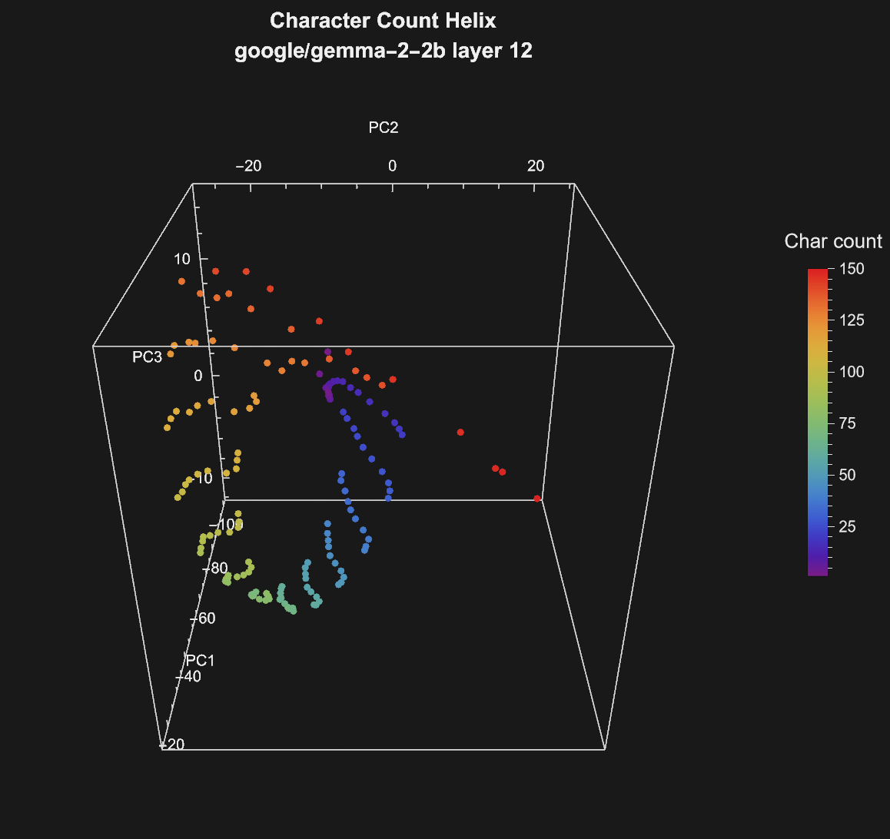

# Character Count Helix — Experiment Results

## What is this?

This folder contains the full results of a **character count helix** experiment
run with [candle-mi](https://crates.io/crates/candle-mi), a mechanistic
interpretability crate for Rust built on [candle](https://github.com/huggingface/candle).

The experiment replicates a key finding from Anthropic's Transformer Circuits
Thread:

> **Anthropic. (2025).** *When Models Manipulate Manifolds: The Geometry of a
> Counting Task.* Transformer Circuits Thread.
> <https://transformer-circuits.pub/2025/linebreaks/index.html>

The original discovery that language models encode **position within a line**
as a **helical manifold** in the residual stream is from:

> **Gurnee, W., Nanda, N., Pauly, M., Harvey, K., Troitskii, D., & Bertsimas, D.
> (2023).** *Finding Neurons in a Haystack: Case Studies with Sparse Probing.*
> Transactions on Machine Learning Research (TMLR).
> <https://arxiv.org/abs/2305.01610>

When you take the mean residual vector for each character count and project
onto the top principal components, the points trace a spiral — a helix —
rather than a line or a cloud.

## Why does this matter?

The character count helix is evidence that transformer models learn
**geometric, periodic representations** of positional features. A helix is the
natural way to encode a cyclic quantity (position within a line wraps around
at each newline) in a high-dimensional space. Finding this structure in a 2B
parameter model, using 30 chapters of Dickens, demonstrates that mechanistic
interpretability tools can surface non-trivial internal representations even
on consumer hardware.

## Layer 12 — Peak helix



*Gemma 2 2B layer 12 residual stream, 30 Dickens chapters, 150 character
counts projected onto PC1–PC3 (98.5% top-6 variance). The spiral is the
model's internal representation of "position within a line."*

## Experiment setup

Two experiments were run:

### Full sweep (26 layers, 10 chapters)

| Parameter            | Value                                          |
|----------------------|-------------------------------------------------|
| **candle-mi version** | v0.1.2 + unreleased commits (post `ffb6c3c`)  |
| **Model**            | `google/gemma-2-2b` (26 layers, hidden=2304)   |
| **Precision**        | F32 (research-grade, matches Python/PyTorch)    |
| **GPU**              | NVIDIA GeForce RTX 5060 Ti (16 GB VRAM)         |
| **Hook point**       | `ResidPost(layer)` for each layer 0–25          |
| **Widths**           | 20, 30, 40, 50, 60, 70, 80, 90, 100, 110, 120, 130, 140, 150 |
| **Max tokens/chunk** | 1024 (auto-tuned from available VRAM)           |
| **PCA components**   | 6                                               |
| **Text corpus**      | 10 Dickens chapters (~170 KB)                   |
| **Total tokens**     | ~530K per layer                                 |
| **Total runtime**    | ~10 hours (26 layers × ~25 min each)            |

### Targeted run (layers 11–13, 30 chapters)

| Parameter            | Value                                          |
|----------------------|-------------------------------------------------|
| **Text corpus**      | 30 Dickens chapters (~490 KB)                   |
| **Total tokens**     | ~1.58M per layer                                |
| **Top-6 variance**   | 98.5% (layer 12)                                |
| **PC breakdown**     | PC1: 56.4%, PC2: 23.7%, PC3: 14.3%             |
| **Runtime**          | ~83 min per layer (~4 hours total for 3 layers)  |

The 30-chapter run produced significantly tighter spirals: PC2+PC3 carry 38%
of variance (vs ~25% with 10 chapters), giving the helix visible width rather
than collapsing into an arc.

## Text corpus

30 chapters from **A Tale of Two Cities** by Charles Dickens, sourced from
[Project Gutenberg](https://www.gutenberg.org/ebooks/98) (public domain, no
licensing restrictions):

- Book the First (Recalled to Life): Chapters I–VI
- Book the Second (The Golden Thread): Chapters I–XXIV

The plain-text files are in the `texts/` subfolder. Each file is named
`CHAPTER <N>.<Title>.txt`.

## Folder contents

```
character_count_helix/
├── README.md              ← this file
├── character_count_helix.rs  ← snapshot of the example source used
├── helix_plot.wl          ← Wolfram Mathematica plotting script
├── sweep.json             ← raw PCA results for all 26 layers (~7 MB)
├── helix_L11-13_L12.json  ← 30-chapter results for layers 11–13
├── texts/                 ← Dickens chapter files (input corpus)
│   ├── CHAPTER I.The Period.txt
│   ├── CHAPTER I.Five Years Later.txt
│   └── ... (30 files total)
└── plots/                 ← generated visualizations
    ├── L12_helix_rotating.gif ← rotating 3D helix (checked into git)
    ├── L0_helix_pc123.png     ← 3D scatter: PC1 vs PC2 vs PC3
    ├── L0_helix_pc456.png     ← 3D scatter: PC4 vs PC5 vs PC6
    ├── L0_cosine_heatmap.png  ← cosine similarity ringing pattern
    ├── L0_variance_bars.png   ← explained variance bar chart
    └── ... (4 plots × 26 layers + GIF)
```

## Key findings

- **Layers 0–6**: The model builds a linear (arc-shaped) representation of
  character count. Points are ordered by count along PC1 but don't curve.
- **Layers 7–10**: The arc bends into a U-shape / horseshoe as the model wraps
  the representation into higher PCA dimensions.
- **Layer 12**: **Peak helix.** The points trace a clear spiral with 2–3
  visible turns in PC1–PC2–PC3 space, color-graded from low to high character
  count. With 30 chapters (1.58M tokens), PC2+PC3 carry 38% of variance,
  giving the helix substantial width. This is the Anthropic/Gurnee finding
  reproduced in Rust on a consumer GPU.
- **Layers 13–16**: The helical structure dissolves as the model transforms
  representations toward next-token prediction.
- **Layers 17–25**: The geometric structure is largely gone; residuals cluster
  rather than spiral.

The cosine similarity heatmaps confirm the helix via a **ringing pattern**:
diagonal bands of alternating high/low similarity, with a period matching the
line widths. This ringing is strongest at layers 5–12.

## Reproducing this experiment

```bash
# Full 26-layer sweep (auto-resumes from existing JSON)
cargo run --release --features transformer,mmap,memory \
    --example character_count_helix -- \
    --sweep all \
    --text-dir examples/results/character_count_helix/texts \
    --output examples/results/character_count_helix/sweep.json

# Targeted run on layers 11-13 only
cargo run --release --features transformer,mmap,memory \
    --example character_count_helix -- \
    --pca-layers 11..14 \
    --text-dir examples/results/character_count_helix/texts \
    --output examples/results/character_count_helix/helix_L11-13.json

# With VRAM debug output (raw DXGI/NVML values on stderr)
cargo run --release --features transformer,mmap,memory-debug \
    --example character_count_helix -- \
    --sweep all \
    --text-dir examples/results/character_count_helix/texts \
    --output examples/results/character_count_helix/sweep.json
```

The `--sweep all` flag processes one layer at a time and saves after each,
so you can interrupt and resume safely. On a 16 GB GPU, `max_tokens` is
auto-tuned to 1024 to prevent CUDA OOM from cuBLAS workspace accumulation.

## Plotting

Open `helix_plot.wl` in Wolfram Mathematica (v13+ recommended). Set the
`jsonFile` variable at the top to the JSON file you want to plot (e.g.,
`"sweep.json"` or `"helix_L11-13_L12.json"`). The script generates 4 plots
per layer and exports PNGs to `plots/`. It also generates a rotating GIF
for layer 12.

## References

1. Anthropic. (2025). *When Models Manipulate Manifolds: The Geometry of a
   Counting Task.* Transformer Circuits Thread.
   <https://transformer-circuits.pub/2025/linebreaks/index.html>

2. Gurnee, W., Nanda, N., Pauly, M., Harvey, K., Troitskii, D., & Bertsimas, D.
   (2023). *Finding Neurons in a Haystack: Case Studies with Sparse Probing.*
   TMLR. <https://arxiv.org/abs/2305.01610>

3. t-tech. (2025). *Chasing the Counting Manifold in Open LLMs.* Hugging Face
   Space. <https://huggingface.co/spaces/t-tech/manifolds#finding-position-features-in-saes>

4. turtleishly. (2025). *Anthropic Linebreak Replication.* GitHub — replication
   of the counting-manifold spiral in Gemma 2 9B.
   <https://github.com/turtleishly/Anthropic-Linebreak-replication>

5. candle-mi documentation: <https://docs.rs/candle-mi>
